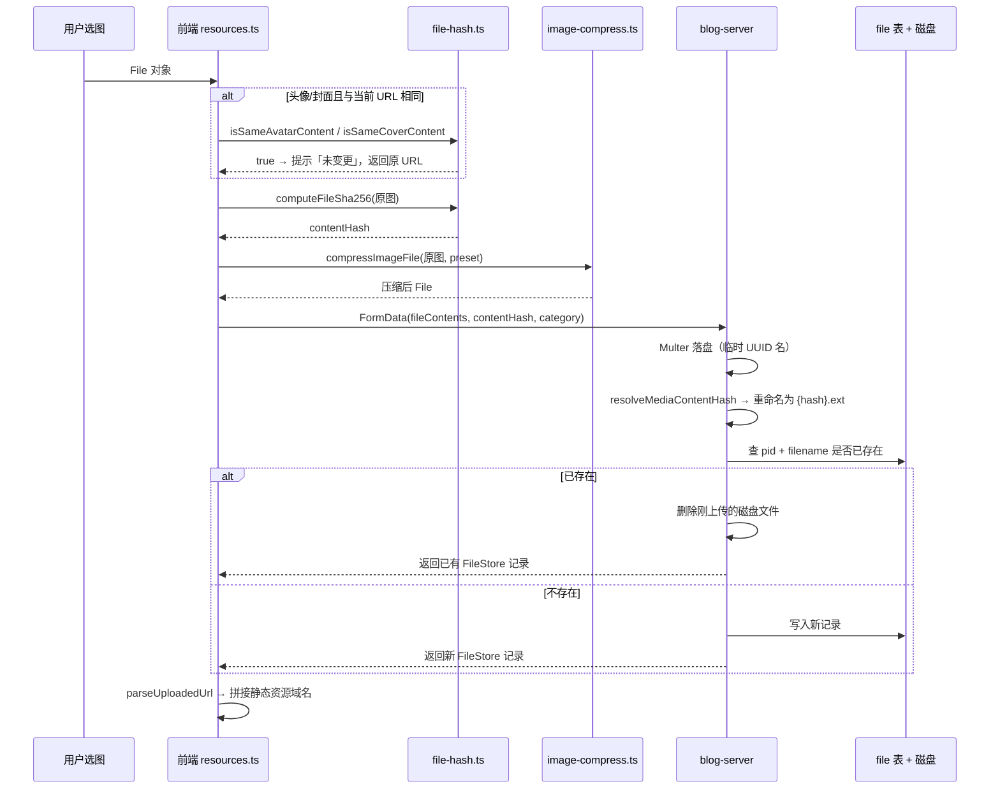

# 博客系统文件上传流程与逻辑

本文档描述 **blog-home-nuxt**、**blog-admin**、**blog-server** 三端统一的图片/文件上传机制，涵盖业务媒体上传（头像、封面、正文图）、资源库上传、大文件分片上传，以及去重、压缩、存储与权限。

> 前端 API 封装入口：`blog-home-nuxt/api/resources.ts`（home）、`blog-admin/src/api/resources.ts`（admin）  
> 后端核心：`blog-server/src/modules/features/resources/`

---

## 1. 上传能力总览

| 类型 | 使用场景 | 前端入口 | 后端接口 | 登录 | 前端压缩 | contentHash 去重 |
|------|----------|----------|----------|------|----------|------------------|
| 注册头像 | home 注册页 | `uploadRegisterAvatar` | `POST /resources/upload-media/register-avatar` | 否 | ✅ | ✅ |
| 修改头像 | home 资料编辑、admin 用户管理 | `uploadAvatar` | `POST /resources/upload-media?category=avatar` | 是 | ✅ | ✅ |
| 文章封面 | home/admin 文章编辑 | `uploadCover` | `POST /resources/upload-media?category=cover` | 是 | ✅ | ✅ |
| 文章正文图 | home/admin Markdown 编辑器 | `uploadArticleImage` | `POST /resources/upload-media?category=article` | 是 | ✅ | ✅（仅服务端） |
| 资源库文件 | admin 资源管理 | Arco Upload 直传 | `POST /resources/uploadFile` | 是 | ❌ | ❌（无 category 时不走 hash 命名） |
| 大文件分片 | home 工具页 | `uploadFileRequest` 等 | `POST /file/uploadBigFile` 等 | 是 | ❌ | 分片级 |

**业务媒体上传**（上表前四行）是本文重点：前端 Canvas 压缩 + 原图 SHA-256 去重 + 服务端按分类入库。

---

## 2. 端到端流程（业务媒体）



---

## 3. 前端层

### 3.1 关键文件

| 文件 | 职责 |
|------|------|
| `api/resources.ts` | 上传 API 封装、FormData 组装、响应解析 |
| `utils/file-hash.ts` | 原图 SHA-256、与当前 URL 比对（头像/封面） |
| `utils/image-compress.ts` | Canvas 压缩，按 preset 输出 WebP/JPEG |
| `utils/static-url.ts` | `/static/...` → 完整可访问 URL |

home 与 admin 的 `resources.ts` / `file-hash.ts` / `image-compress.ts` 逻辑基本一致；admin 额外提供 `resolveStaticUrl`（拼 `staticUrl` 配置）。

### 3.2 上传前压缩（preset）

| category | maxWidth | maxHeight | quality | fit | 说明 |
|----------|----------|-----------|---------|-----|------|
| `avatar` | 400 | 400 | 0.82 | cover | 居中裁剪 |
| `cover` | 1200 | 800 | 0.82 | cover | 居中裁剪 |
| `article` | 800 | — | 0.75 | inside | 等比缩放，宽不超过 800 |

- GIF、SVG 跳过压缩，原样上传。
- 压缩后体积未减小则保留原文件。
- 压缩在浏览器 Canvas 完成，**服务端不再二次压缩**。

### 3.3 contentHash 计算

```ts
// utils/file-hash.ts
computeFileSha256(file: Blob)
```

- 对**原图**（压缩前）计算 SHA-256，hex 小写 64 位。
- 优先使用 `crypto.subtle`；非安全上下文（如 HTTP + 局域网 IP）回退 `crypto-js`。
- 该 hash 作为 `contentHash` 字段随 FormData 提交，也用于服务端文件命名。

### 3.4 前端「未变更」检测（仅头像 / 封面）

`isSameMediaContent(originalFile, currentUrl, preset)` 在实际上传前拦截重复选图：

1. **跳过条件**：无 `currentUrl`；或头像 URL 含 `default`（默认头像）。
2. **新命名匹配**：原图 hash 与当前 URL 的 basename 比对（`{hash}.webp` 或 `{hash}`）。
3. **旧 UUID 兼容**：本地压缩后与线上下载文件的字节 hash 比对。

命中后提示「头像未变更」/「封面未变更」，直接返回原 `/static` 路径，**不发起网络请求**。

**文章正文图**（`uploadArticleImage`）**不做**此检测，每次选图都会请求服务端（服务端仍会去重）。

### 3.5 FormData 字段

```
fileContents  → 压缩后的图片文件（可多文件，avatar 服务端限 1）
contentHash   → 原图 SHA-256
category      → avatar | cover | article（body 或 query）
```

### 3.6 响应解析

```ts
parseUploadedPath(res)  // 提取 /static/uploads/... 相对路径
parseUploadedUrl(res)   // resolveStaticUrl 拼域名，供 img src / 表单写入
```

home 的 `request.post` 已 unwrap 外层包装，响应可能是 `FileStore[]` 或带 `data` 的对象；`parseUploadedPath` 兼容多种形态。

### 3.7 业务调用点

| 端 | 页面/组件 | 函数 |
|----|-----------|------|
| home | `pages/register/index.vue` | `uploadRegisterAvatar` |
| home | `components/user/profile-edit-form.vue` | `uploadAvatar` |
| home | `components/user/article-edit-form.vue` | `uploadCover`、`uploadArticleImage`（经 `api/article.ts`） |
| admin | `views/user/index.vue`、`views/system/addUser.vue` | `uploadAvatar` |
| admin | `views/article/edit.vue` | `uploadCover`、`uploadArticleImage` |

---

## 4. 后端层

### 4.1 API 路由

| 路由 | Guard | 说明 |
|------|-------|------|
| `POST /resources/upload-media/register-avatar` | 公开（`isPublic=1`） | 注册头像，固定 `category=avatar` |
| `POST /resources/upload-media?category=` | JWT | 登录用户媒体上传 |
| `POST /resources/uploadFile` | JWT | 资源库通用上传，需 `pid` |
| `GET /resources/register-avatars` | 公开 | 注册页可选头像列表 |

权限码（见 `deploy/sql/migrate-upload-media.sql`）：

- `resources:upload-media:register` — 注册头像
- `resources:upload-media` — 登录用户媒体上传

### 4.2 分类与存储目录

定义于 `resource-dirs.constants.ts`：

| category | DB folderId（pid） | 磁盘目录 |
|----------|-------------------|----------|
| `avatar` | `REGISTER_AVATAR_FOLDER_ID` | `{filePath}avatar/` |
| `cover` | `ARTICLE_COVER_FOLDER_ID` | `{filePath}{YYYY-MM}/` |
| `article` | `ARTICLE_IMAGE_FOLDER_ID` | `{filePath}{YYYY-MM}/` |

- `avatar` 使用固定子目录；`cover` / `article` 按上传月份分目录。
- 去重查询按 **`pid + filename`**，不区分月份子目录——同分类下跨月重复上传仍命中已有记录。

### 4.3 Multer 落盘（临时文件名）

`resources.module.ts`：

1. 根据 `query/body.category` 或 URL 是否含 `register-avatar` 解析 category。
2. 写入对应 destination。
3. 媒体类上传临时文件名为 `{uuid}{ext}`（无 contentHash 时）。
4. 非媒体类（资源库 `uploadFile` 无 category）文件名为 `{uuid}-{originalname}`。

### 4.4 服务端去重与命名（uploadFile）

`resources.service.ts` → `uploadFile(files, pid, category, contentHash?)`：

```
1. resolveMediaContentHash(contentHash, diskPath)
   - 客户端 contentHash 合法（64 位 hex）→ 直接使用
   - 否则对磁盘临时文件流式 SHA-256

2. 重命名：{dedupHash}{ext}

3. 查库：WHERE pid = effectivePid AND filename = hashFilename AND isFolder = false

4. 已存在 → unlink 新文件，返回已有 FileStore
   不存在 → save 新记录
```

**去重范围**：仅在**同一 category（同一 pid）**内。同一原图分别作为头像、封面、正文图会各存一条记录。

### 4.5 FileStore 实体

表 `file` 主要字段：`id`、`pid`（所属文件夹）、`filename`、`originalname`、`type`、`size`、`url`（如 `/static/uploads/avatar/abc....webp`）。

---

## 5. 去重逻辑详解

### 5.1 两层去重

| 层级 | 适用 | 依据 | 效果 |
|------|------|------|------|
| 前端预检 | 头像、封面 | 原图 hash / 压缩字节比对 | 跳过 HTTP 请求，UX 提示 |
| 服务端 | avatar、cover、article | 原图 contentHash → 文件名 | 同分类不重复落盘、不重复入库 |

### 5.2 为何用「原图 hash」而非「压缩后 hash」

- 压缩参数固定，同一原图压缩结果稳定。
- 文件名可预测：`{原图SHA256}.webp`，便于 URL basename 直接比对。
- 旧版 UUID 命名文件通过「压缩后字节比对」兼容。

### 5.3 典型场景

| 操作 | 结果 |
|------|------|
| 改头像时又选当前图 | 前端拦截 |
| 两用户上传相同原图作头像 | 服务端第二条返回同一 URL，不重复存盘 |
| 文章编辑器两次插入同一张图 | 无前端拦截；第二次服务端返回已有 URL |
| 同图既作封面又作正文图 | 各 category 各一条记录 |
| 资源库 uploadFile 直传 | 无 contentHash，UUID 命名，不去重 |

---

## 6. 其他上传路径

### 6.1 Admin 资源库（uploadFile）

- 页面：`blog-admin/src/views/resource/list.vue`
- 直传 `POST /resources/uploadFile`，字段 `fileContents` + `pid`（当前文件夹 ID）
- **不传 category / contentHash**，不走媒体 hash 命名与去重
- 适用于管理后台通用文件管理

### 6.2 大文件分片上传

- 页面：`blog-home-nuxt/pages/tool/upload-slice/index.vue`
- API：`api/tool.ts` → `/file/uploadBigFile`、`/merge`、`/checkFile`
- 模块：`blog-server/src/modules/features/file/`
- 与业务媒体上传独立，用于大文件断点续传演示/工具

---

## 7. 静态资源访问

上传成功后 `FileStore.url` 形如：

```
/static/uploads/avatar/{hash}.webp
/static/uploads/2025-06/{hash}.webp
```

前端通过 `resolveStaticUrl` 拼接 `VITE_NUXT_STATIC_ORIGIN_URL`（或 `VITE_NUXT_ORIGIN_URL`）得到浏览器可访问地址。Nginx / Nest 静态目录映射见部署文档。

---

## 8. 扩展与注意事项

### 8.1 新增一种媒体 category

1. 在 `resource-dirs.constants.ts` 增加 `ResourceCategory` 与 `RESOURCE_DIR_MAP` 条目。
2. 在 `resources.controller.ts` 的 `allowed` 数组中加入 category。
3. 在 `image-compress.ts` 的 `PRESET_MAP` 增加压缩参数。
4. 在前端 `resources.ts` 增加封装函数；若需「未变更」检测，在 `file-hash.ts` 增加 `isSameXxxContent`。
5. 执行权限 SQL 增量（若需新路由）。

### 8.2 正文图前端去重（未实现）

若需「编辑器内已有相同 URL 则跳过」，需在 Markdown 上传回调中自行比对，当前未做。

### 8.3 安全上下文与 hash

本地开发若通过 `http://192.168.x.x:5050` 访问，Web Crypto 不可用，已用 `crypto-js` 回退；生产 HTTPS 无此问题。

### 8.4 相关 SQL 迁移

- `blog-server/deploy/sql/migrate-upload-media.sql` — 上传权限与路由
- 注册可选头像数据位于 `pid = REGISTER_AVATAR_FOLDER_ID` 的 file 记录

---

## 9. 文件索引（快速定位）

```
blog-home-nuxt/
  api/resources.ts          # 上传 API
  api/article.ts            # 正文图封装（转 parseUploadedUrl）
  utils/file-hash.ts        # SHA-256 + 未变更检测
  utils/image-compress.ts   # Canvas 压缩
  utils/static-url.ts       # 静态 URL 拼接

blog-admin/
  src/api/resources.ts
  src/utils/file-hash.ts
  src/utils/image-compress.ts
  src/views/resource/list.vue   # 资源库直传

blog-server/
  src/modules/features/resources/
    resources.controller.ts
    resources.service.ts
    resources.module.ts
    resource-dirs.constants.ts
  src/modules/features/file/
    file.entity.ts
    file.controller.ts        # 大文件分片
  deploy/sql/migrate-upload-media.sql
```
